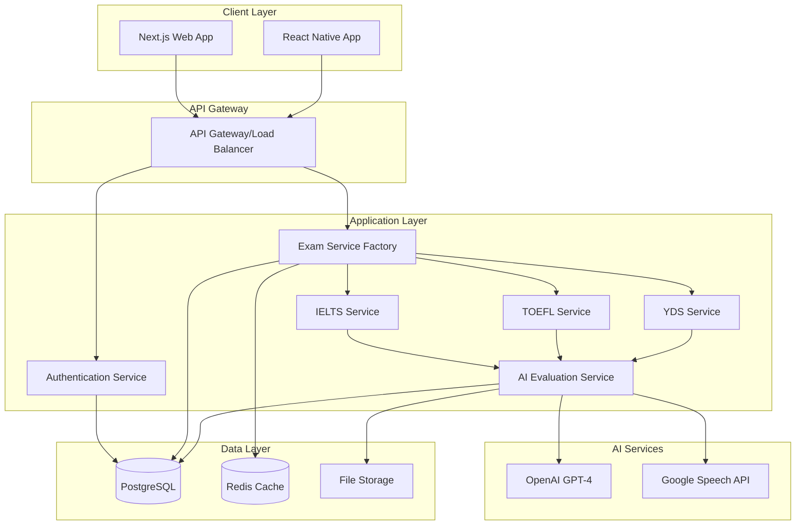
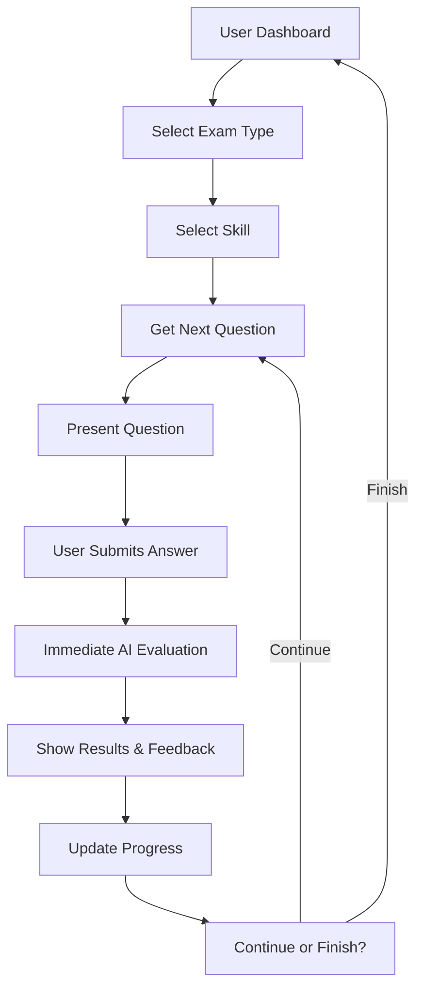

# OpenEnglishTutor - System Architecture

## Overview

OpenEnglishTutor is a modular, multi-exam English preparation platform supporting IELTS, TOEFL, and YDS with individual question-based learning and immediate AI feedback.

## System Architecture

### Core Principles
- **Individual Question Flow**: Questions presented one-by-one with immediate evaluation
- **Multi-Exam Support**: Modular architecture supporting different exam types
- **AI-Powered Evaluation**: Immediate feedback using OpenAI and Google Cloud services
- **Scalable Design**: Easy addition of new exam types without affecting existing ones

### Architecture Diagram


## Database Schema

### Core Tables
```sql
-- Users (universal across all exam types)
users (
  id: UUID PRIMARY KEY,
  email: VARCHAR UNIQUE NOT NULL,
  password_hash: VARCHAR NOT NULL,
  first_name: VARCHAR,
  last_name: VARCHAR,
  preferred_language: VARCHAR DEFAULT 'en',
  created_at: TIMESTAMP,
  updated_at: TIMESTAMP
)

-- Exam types configuration (extensible)
exam_types (
  id: UUID PRIMARY KEY,
  code: VARCHAR UNIQUE NOT NULL, -- 'ielts', 'toefl', 'yds'
  name: VARCHAR NOT NULL,
  description: TEXT,
  scoring_system: JSONB, -- Different scoring systems per exam
  skills: JSONB, -- Available skills for each exam type
  is_active: BOOLEAN DEFAULT true,
  created_at: TIMESTAMP
)

-- Skills per exam type
exam_skills (
  id: UUID PRIMARY KEY,
  exam_type_id: UUID REFERENCES exam_types(id),
  skill_code: VARCHAR NOT NULL, -- 'reading', 'listening', 'writing', 'speaking', 'grammar', 'vocabulary'
  skill_name: VARCHAR NOT NULL,
  max_score: DECIMAL(4,2),
  evaluation_type: ENUM('objective', 'subjective', 'ai_powered'),
  is_active: BOOLEAN DEFAULT true,
  created_at: TIMESTAMP,
  UNIQUE(exam_type_id, skill_code)
)

-- Questions with exam type support
questions (
  id: UUID PRIMARY KEY,
  exam_type_id: UUID REFERENCES exam_types(id),
  skill_id: UUID REFERENCES exam_skills(id),
  question_type: ENUM('multiple_choice', 'true_false', 'fill_blank', 'essay', 'speaking', 'matching', 'ordering'),
  difficulty_level: ENUM('easy', 'medium', 'hard'),
  title: VARCHAR NOT NULL,
  content: TEXT NOT NULL,
  instructions: TEXT,
  audio_url: VARCHAR,
  image_url: VARCHAR,
  correct_answer: TEXT,
  options: JSONB,
  time_limit: INTEGER DEFAULT 300,
  points: INTEGER DEFAULT 1,
  metadata: JSONB,
  created_at: TIMESTAMP,
  updated_at: TIMESTAMP
)

-- Question attempts with immediate evaluation
question_attempts (
  id: UUID PRIMARY KEY,
  user_id: UUID REFERENCES users(id),
  question_id: UUID REFERENCES questions(id),
  exam_type_id: UUID REFERENCES exam_types(id),
  skill_id: UUID REFERENCES exam_skills(id),
  user_answer: TEXT NOT NULL,
  audio_url: VARCHAR,
  time_spent: INTEGER,
  submitted_at: TIMESTAMP DEFAULT NOW(),
  
  -- Evaluation results
  is_correct: BOOLEAN,
  score: DECIMAL(4,2), -- Normalized score
  raw_score: DECIMAL(4,2), -- Original exam-specific score
  evaluation_feedback: TEXT,
  suggestions: TEXT,
  criteria_scores: JSONB,
  metadata: JSONB
)

-- User progress per exam type and skill
user_exam_progress (
  id: UUID PRIMARY KEY,
  user_id: UUID REFERENCES users(id),
  exam_type_id: UUID REFERENCES exam_types(id),
  skill_id: UUID REFERENCES exam_skills(id),
  total_questions: INTEGER DEFAULT 0,
  correct_answers: INTEGER DEFAULT 0,
  total_points: INTEGER DEFAULT 0,
  earned_points: INTEGER DEFAULT 0,
  average_score: DECIMAL(4,2),
  best_score: DECIMAL(4,2),
  last_activity: TIMESTAMP,
  updated_at: TIMESTAMP,
  UNIQUE(user_id, exam_type_id, skill_id)
)

-- Exam-specific evaluation criteria
evaluation_criteria (
  id: UUID PRIMARY KEY,
  exam_type_id: UUID REFERENCES exam_types(id),
  skill_id: UUID REFERENCES exam_skills(id),
  criteria_name: VARCHAR NOT NULL,
  criteria_description: TEXT,
  max_score: DECIMAL(4,2),
  weight: DECIMAL(3,2) DEFAULT 1.0,
  is_active: BOOLEAN DEFAULT true
)
```

## Exam Type Configurations

### IELTS Configuration
```json
{
  "code": "ielts",
  "name": "IELTS Academic",
  "scoring_system": {
    "scale": "0-9",
    "increment": 0.5,
    "passing_score": 6.0
  },
  "skills": [
    {
      "code": "reading",
      "name": "Reading",
      "max_score": 9.0,
      "evaluation_type": "objective",
      "criteria": ["accuracy", "speed"]
    },
    {
      "code": "listening",
      "name": "Listening", 
      "max_score": 9.0,
      "evaluation_type": "objective",
      "criteria": ["accuracy", "comprehension"]
    },
    {
      "code": "writing",
      "name": "Writing",
      "max_score": 9.0,
      "evaluation_type": "ai_powered",
      "criteria": [
        {"name": "Task Achievement", "weight": 0.25},
        {"name": "Coherence and Cohesion", "weight": 0.25},
        {"name": "Lexical Resource", "weight": 0.25},
        {"name": "Grammatical Range", "weight": 0.25}
      ]
    },
    {
      "code": "speaking",
      "name": "Speaking",
      "max_score": 9.0,
      "evaluation_type": "ai_powered",
      "criteria": [
        {"name": "Fluency and Coherence", "weight": 0.25},
        {"name": "Lexical Resource", "weight": 0.25},
        {"name": "Grammatical Range", "weight": 0.25},
        {"name": "Pronunciation", "weight": 0.25}
      ]
    }
  ]
}
```

### TOEFL Configuration
```json
{
  "code": "toefl",
  "name": "TOEFL iBT",
  "scoring_system": {
    "scale": "0-120",
    "increment": 1,
    "passing_score": 80
  },
  "skills": [
    {
      "code": "reading",
      "name": "Reading",
      "max_score": 30,
      "evaluation_type": "objective"
    },
    {
      "code": "listening",
      "name": "Listening",
      "max_score": 30,
      "evaluation_type": "objective"
    },
    {
      "code": "writing",
      "name": "Writing",
      "max_score": 30,
      "evaluation_type": "ai_powered",
      "criteria": [
        {"name": "Development", "weight": 0.33},
        {"name": "Organization", "weight": 0.33},
        {"name": "Language Use", "weight": 0.34}
      ]
    },
    {
      "code": "speaking",
      "name": "Speaking",
      "max_score": 30,
      "evaluation_type": "ai_powered",
      "criteria": [
        {"name": "Delivery", "weight": 0.33},
        {"name": "Language Use", "weight": 0.33},
        {"name": "Topic Development", "weight": 0.34}
      ]
    }
  ]
}
```

### YDS Configuration
```json
{
  "code": "yds",
  "name": "YDS (Yabancı Dil Sınavı)",
  "scoring_system": {
    "scale": "0-100",
    "increment": 1,
    "passing_score": 60
  },
  "skills": [
    {
      "code": "reading",
      "name": "Reading Comprehension",
      "max_score": 100,
      "evaluation_type": "objective"
    },
    {
      "code": "listening",
      "name": "Listening Comprehension",
      "max_score": 100,
      "evaluation_type": "objective"
    },
    {
      "code": "grammar",
      "name": "Grammar",
      "max_score": 100,
      "evaluation_type": "objective"
    },
    {
      "code": "vocabulary",
      "name": "Vocabulary",
      "max_score": 100,
      "evaluation_type": "objective"
    }
  ]
}
```

## Service Architecture

### Exam Service Factory Pattern
```typescript
// Factory pattern for exam services
export class ExamServiceFactory {
  static createService(examType: string): ExamService {
    switch (examType.toLowerCase()) {
      case 'ielts':
        return new IELTSService();
      case 'toefl':
        return new TOEFLService();
      case 'yds':
        return new YDSService();
      default:
        throw new Error(`Unsupported exam type: ${examType}`);
    }
  }
}

// Base interface for all exam services
export interface ExamService {
  getNextQuestion(userId: string, skillCode: string, difficulty?: string): Promise<Question>;
  evaluateAnswer(question: Question, answer: string, audioUrl?: string): Promise<Evaluation>;
  calculateScore(attempts: QuestionAttempt[]): Promise<ExamScore>;
  getProgressReport(userId: string, skillCode?: string): Promise<ProgressReport>;
}
```

### Universal Question Service
```typescript
export class QuestionService {
  async getNextQuestion(
    userId: string, 
    examTypeId: string, 
    skillId: string, 
    difficulty?: string
  ) {
    // Adaptive difficulty selection
    const targetDifficulty = difficulty || await this.getAdaptiveDifficulty(
      userId, examTypeId, skillId
    );

    // Avoid recent questions
    const recentAttempts = await this.getRecentAttempts(userId, examTypeId, skillId);
    const excludeIds = recentAttempts.map(attempt => attempt.questionId);

    return await this.prisma.question.findFirst({
      where: {
        examTypeId,
        skillId,
        difficultyLevel: targetDifficulty,
        id: { notIn: excludeIds }
      },
      include: { examType: true, skill: true }
    });
  }

  async submitAnswer(
    questionId: string,
    userId: string,
    answer: string,
    audioUrl?: string,
    timeSpent?: number
  ) {
    const question = await this.getQuestionWithContext(questionId);
    
    // Use appropriate exam service for evaluation
    const examService = ExamServiceFactory.createService(question.examType.code);
    const evaluation = await examService.evaluateAnswer(question, answer, audioUrl);

    // Save attempt with immediate evaluation
    const attempt = await this.saveAttempt(userId, question, answer, evaluation, timeSpent);
    
    // Update user progress
    await this.updateUserProgress(userId, question.examTypeId, question.skillId, evaluation);

    return {
      attempt,
      evaluation,
      progress: await this.getUserProgress(userId, question.examTypeId, question.skillId)
    };
  }
}
```

## API Design

### Core Endpoints
```typescript
// Universal endpoints
GET  /api/exam-types                    // Get available exam types
GET  /api/exams/{type}/skills          // Get skills for exam type
GET  /api/questions/next               // Get next question
POST /api/questions/{id}/submit        // Submit answer with immediate evaluation
GET  /api/progress/{examType}          // Get progress for exam type
GET  /api/progress/comparison          // Compare progress across exams

// Authentication
POST /api/auth/register                // User registration
POST /api/auth/login                   // User login
GET  /api/auth/profile                 // Get user profile
PUT  /api/auth/profile                 // Update user profile

// Exam-specific evaluation
POST /api/evaluate/ielts/writing       // IELTS writing evaluation
POST /api/evaluate/toefl/speaking      // TOEFL speaking evaluation
POST /api/evaluate/yds/grammar         // YDS grammar evaluation
```

## Frontend Architecture

### Component Structure
```
components/
├── exam/
│   ├── ExamSelector/              # Choose exam type
│   ├── UniversalQuestionFlow/     # Works with all exam types
│   ├── ExamTypeCard/              # Display exam info
│   └── SkillSelector/             # Choose skill within exam
├── question/
│   ├── QuestionCard/              # Universal question display
│   ├── AnswerInput/               # Different input types
│   ├── Timer/                     # Per-question timer
│   └── AudioRecorder/             # For speaking questions
├── feedback/
│   ├── InstantFeedback/           # Immediate results
│   ├── ScoreDisplay/              # Score visualization
│   ├── ProgressChart/             # Progress tracking
│   └── ComparisonView/            # Cross-exam comparison
└── dashboard/
    ├── MultiExamDashboard/        # Main dashboard
    ├── ExamProgressCard/          # Progress per exam
    ├── RecommendationPanel/       # Exam recommendations
    └── StreakCounter/             # Daily practice streak
```

### User Flow


## AI Integration

### Writing Evaluation
```typescript
async evaluateWriting(question: Question, answer: string): Promise<Evaluation> {
  const examType = question.examType.code;
  const criteria = await this.getEvaluationCriteria(question.skillId);
  
  const prompt = this.buildWritingPrompt(examType, question, answer, criteria);
  
  const response = await this.openai.chat.completions.create({
    model: 'gpt-4',
    messages: [{ role: 'user', content: prompt }],
    temperature: 0.3,
  });

  return this.parseEvaluation(response.choices[0].message.content, examType);
}
```

### Speaking Evaluation
```typescript
async evaluateSpeaking(question: Question, audioUrl: string): Promise<Evaluation> {
  // 1. Transcribe audio using Google Speech API
  const transcription = await this.speechService.transcribe(audioUrl);
  
  // 2. Evaluate transcription with AI
  const evaluation = await this.evaluateSpokenResponse(question, transcription);
  
  return {
    ...evaluation,
    transcription,
    audioUrl
  };
}
```

## Security & Performance

### Security Measures
- JWT-based authentication with refresh tokens
- Input validation and sanitization
- Rate limiting for AI API calls
- CORS configuration
- Data encryption at rest

### Performance Optimization
- Redis caching for questions and user sessions
- Database query optimization with proper indexing
- CDN for static assets and audio files
- Lazy loading of components
- Audio compression for faster loading

## Scalability Considerations

### Horizontal Scaling
- Stateless API design
- Database connection pooling
- Load balancing with multiple API instances
- Microservices architecture ready

### Monitoring & Analytics
- Error tracking with Sentry
- Performance monitoring
- User analytics with Mixpanel
- AI usage and cost tracking

This architecture provides a solid foundation for a scalable, maintainable multi-exam English preparation platform that can grow and adapt to new requirements.